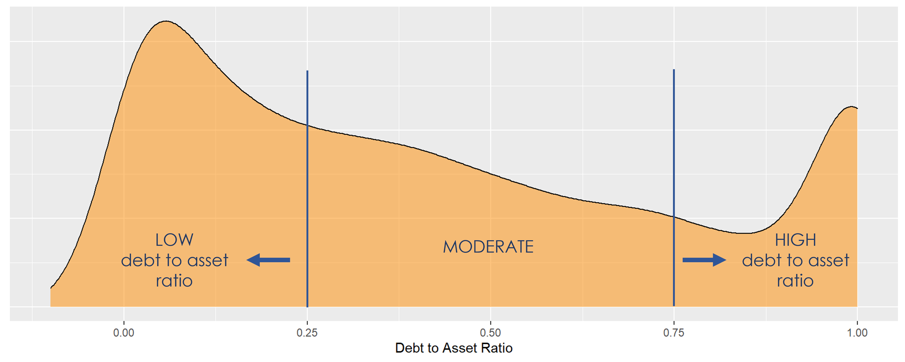
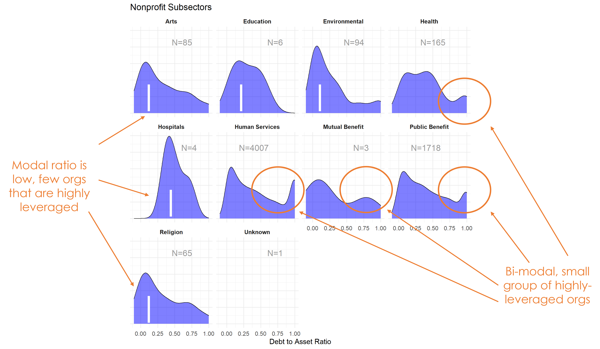

```{r setup, include=FALSE}
knitr::opts_chunk$set( echo = TRUE, message=F, warning=F, 
                       fig.width = 10, fig.height = 10, 
                       collapse = TRUE )
```


<hr>
<br>


```{r header-image, fig.width = 3.5, fig.height = 1, echo = FALSE}
# All defaults
knitr::include_graphics(here::here("img", "logo.png"))
```


```{r, echo=F}

# Setup

## Packages

library( haven )        # importing data files 
library( tidyr )        # data wrangling
library( dplyr )        # data wrangling 
library( ggplot2 )      # fancy plots 
library( ggthemes )     # fancy plots
library( scales )       # re-scaling numbers
library( stargazer )    # nice tables 
library( pander )       # format tables for HTML 
library( knitr )        # formatting functions 
library( DT )           # embed datasets in HTML docs

source( "r-functions.R" )

variable.label="Debt to Asset Ratio"

# stargazer table print type
# run chunk for live RMD sessions
s.type <- "text"

# stargazer table print type
# resets to html when knitting
s.type <- "html"


## Load Data

# local: 
core <- readRDS( "02-data-wrangled/core.rds" )

# from github: 
# URL <- "https://github.com/lecy/fiscal-health/raw/main/02-data-wrangled/core.rds"
# core <- readRDS(gzcon(url( URL )))


# Preview the data: 
# table( core$NTEE1 ) %>% kable()
# head(core) %>% pander()
```


<br>
<hr>
<br>


# Debt to Asset Ratio


## Definition


$$DAR = \frac{Total \: Liabilities}{Total \: Assets}$$

Notes: Variables should be equivalent for 990 and EZ filers in the IRS data. 


## Variables 

Total liabilities, EOY 

* On 990: Part X, line 26B  
  - SOI PC EXTRACTS: totliabend  
  - NCCS Core:  
* On EZ: Part II, line 26B  

Denominator: Total assets, EOY

*	On 990: Part X, line 16B  
*	On EZ: Part II, line 25B  


## Tabulation 


```{r, eval=T}
# can't divide by zero
zero.these <- core$totassetsend == 0 
core$totassetsend[ core$totassetsend == 0 ] <- NA 

core$dar <- core$totliabend / core$totassetsend

```


## Standardize Scales

Check high and low values to see what makes sense. 

A ratio below 0 is odd because it means assets are negative and liabilities are positive. 

A ratio above 1 might be realistic, but not more meaningful than knowing the ratio is at least one, which means the org has liabilities that as as large or larger than assets. Practically, a ratio of 1 or 2 probably mean the same thing for an organization (they are in trouble). 

```{r, fig.height=4}
ggplot( core, aes(x = dar )) +  
  geom_density( alpha = 0.5, fill="blue" ) + 
  xlim( -1, 2 ) 

core$dar[ core$dar < 0 ] <- 0
core$dar[ core$dar >  1 ] <-  1
```


## Metric Scope

Score describes whether the metric applies to all 990 filers, or only the full 990 filers (if the variable is not included on the 990-EZ form). 

Tax data is available for both full 990 and 990-EZ filers, so this metric describes all orgs.

*Scope codes:*

* PZ: *Both 990 and 990-EZ filers*   
* PC: *Only full 990 (public charity or PC) filers only*  
* EZ: *Only 990-EZ filers*  


## Reference


Any cited works here...


# Descriptive Statistics


Put Debt to Asset Ratio on a scale of -10,000 to +20,000. 

Convert everything else to thousands of dollars. 

```{r, results="asis"}
# rescale DAR where 1 = 10,000 

core %>%
  mutate( dar = dar * 10000,
    totrevenue = totrevenue / 1000,
    totfuncexpns = totfuncexpns / 1000, 
    lndbldgsequipend = lndbldgsequipend / 1000,
    totassetsend = totassetsend / 1000,
    totliabend = totliabend / 1000,
    totnetassetend = totnetassetend / 1000 ) %>% 
  select( STATE, AGE, NTEE1, NTMAJ12, 
          dar, totrevenue, totfuncexpns, lndbldgsequipend, 
          totassetsend, totliabend, totnetassetend   ) %>%

  stargazer( type = s.type, 
             digits=0, 
             summary.stat = c("min","p25","median",
                              "mean","p75","max", "sd") )
```


What proportion of orgs have a DAR of zero (no outstanding liabilities)?


```{r}
prop.zero <- mean( core$dar == 0, na.rm=T )
```


In the sample, `r 100*round(prop.zero,2)` percent of the organizations have a DAR of zero, meaning they carried no debt. These organizations are dropped from subsequent graphs to keep the visualizations clean. The interpretation of the graphics should be the distributions of Debt to Asset Ratio for organizations that carry debt. 

Filter out cases with DAR=0 because they dominate the graphics otherwise.  

```{r}
# drop cases where DAR=0
core2 <-  core 
core2$dar[ core2$dar == 0 ] <- NA
```

Create quantile groups: 

```{r}
###
### ADD QUANTILES
###
###   function create_quantiles() defined in r-functions.R

core2$exp.q   <- create_quantiles( var=core2$totfuncexpns,   n.groups=5 )
core2$rev.q   <- create_quantiles( var=core2$totrevenue,     n.groups=5 )
core2$asset.q <- create_quantiles( var=core2$totnetassetend, n.groups=5 )
core2$age.q   <- create_quantiles( var=core2$AGE,            n.groups=5 )
core2$land.q  <- create_quantiles( var=core2$lndbldgsequipend, n.groups=5 )
```


## DAR Density 

```{r, fig.height=4}
ggplot( core2, aes(x = dar )) +  
  geom_density( alpha = 0.5, fill="darkorange" ) + 
  xlim( -0.1, 1 ) +
  xlab( variable.label ) +
  theme( axis.title.y=element_blank(),
         axis.text.y=element_blank(), 
         axis.ticks.y=element_blank() )
```


<br>
<hr>
<br>



<br>
<hr>
<br>


## DAR by NTEE Major Code


```{r}
core3 <- core2 %>% filter( ! is.na(NTEE1) )
table( core3$NTEE1) %>% sort(decreasing=TRUE) %>% kable()
```


```{r}

t <- table( factor(core3$NTEE1) ) 
df <- data.frame( x=Inf, y=Inf, 
                  N=paste0( "N=", as.character(t) ), 
                  NTEE1=names(t) )

ggplot( core3, aes( x=dar ) ) + 
  geom_density( alpha = 0.5, fill="blue" ) + 
  xlim( -0.1, 1 ) +
  labs( title="Nonprofit Subsectors" ) + 
  xlab( variable.label ) + 
  facet_wrap( ~ NTEE1, nrow=1 ) + 
    theme_minimal( base_size = 15 )  + 
    theme( axis.title.y=element_blank(),
           axis.text.y=element_blank(), 
           axis.ticks.y=element_blank(),
           strip.text = element_text( face="bold") ) +  # size=20 
  geom_text( data=df, 
             aes(x, y, label=N ), 
             hjust=2, vjust=3, 
             color="gray60", size=6 )
```


<br>
<hr>
<br>




<br>
<hr>
<br>


## DAR by Region 

```{r}
table( core$Region) %>% kable()
```


```{r}
t <- table( factor(core3$Region) ) 
df <- data.frame( x=Inf, y=Inf, 
                  N=paste0( "N=", as.character(t) ), 
                  Region=names(t) )

core2 %>% 
  filter( ! is.na(Region) ) %>% 
  ggplot( aes(dar) )  + 
    geom_density( alpha = 0.5, fill="blue" ) + 
    xlab( "Census Regions" ) + 
    ylab( variable.label ) +
    facet_wrap( ~ Region, nrow=3 ) + 
    theme_minimal( base_size = 22 )  + 
    theme( axis.title.y=element_blank(),
           axis.text.y=element_blank(), 
           axis.ticks.y=element_blank() ) + 
    geom_text( data=df, 
             aes(x, y, label=N ), 
             hjust=2, vjust=3, 
             color="gray60", size=6 )
```


```{r}
table( core$Division ) %>% kable()
```

```{r}
t <- table( factor(core3$Division) ) 
df <- data.frame( x=Inf, y=Inf, 
                  N=paste0( "N=", as.character(t) ), 
                  Division=names(t) )

core2 %>% 
  filter( ! is.na(Division) ) %>% 
  ggplot( aes(dar) )  + 
    geom_density( alpha = 0.5, fill="blue" ) + 
    xlab( "Census Sub-Regions (10)" ) + 
    ylab( variable.label ) +
    facet_wrap( ~ Division, nrow=3 ) + 
    theme_minimal( base_size = 22 )  + 
    theme( axis.title.y=element_blank(),
           axis.text.y=element_blank(), 
           axis.ticks.y=element_blank() ) + 
    geom_text( data=df, 
             aes(x, y, label=N ), 
             hjust=2, vjust=3, 
             color="gray60", size=6 ) 
```


## DAR by Nonprofit Size (Expenses)


```{r, fig.height=4}
ggplot( core2, aes(x = totfuncexpns )) +  
  geom_density( alpha = 0.5, fill="darkorange" ) + 
  xlim( quantile(core2$totfuncexpns, c(0.02,0.98), na.rm=T ) )
```


```{r, fig.height=5}
core2$totfuncexpns[ core2$totfuncexpns < 1 ] <- 1
# core2$totfuncexpns[ is.na(core2$totfuncexpns) ] <- 1

if( nrow(core2) > 10000 )
{
  core3 <- sample_n( core2, 10000 )
} else
{
  core3 <- core2
}

jplot( log10(core3$totfuncexpns), core3$dar, 
       xlab="Nonprofit Size (logged Expenses)", 
       ylab=variable.label,
       xaxt="n", xlim=c(3,10) )
axis( side=1, 
      at=c(3,4,5,6,7,8,9,10), 
      labels=c("1k","10k","100k","1m","10m","100m","1b","10b") )
```


```{r}
core2 %>% 
  filter( ! is.na(exp.q) ) %>% 
  ggplot( aes(dar) )  + 
    geom_density( alpha = 0.5, fill="blue" ) + 
    labs( title="Nonprofit Size (logged expenses)" ) + 
    xlab( variable.label ) +
    facet_wrap( ~ exp.q, nrow=3 ) + 
    theme_minimal( base_size = 22 )  + 
    theme( axis.title.y=element_blank(),
           axis.text.y=element_blank(), 
           axis.ticks.y=element_blank() )
```


## DAR by Nonprofit Size (Revenue)


```{r, fig.height=4}
ggplot( core2, aes(x = totrevenue )) +  
  geom_density( alpha = 0.5, fill="darkorange" ) + 
  xlim( quantile(core2$totrevenue, c(0.02,0.98), na.rm=T ) ) + 
  theme( axis.title.y=element_blank(),
           axis.text.y=element_blank(), 
           axis.ticks.y=element_blank() )
```


```{r, fig.height=5}
core2$totrevenue[ core2$totrevenue < 1 ] <- 1

if( nrow(core2) > 10000 )
{
  core3 <- sample_n( core2, 10000 )
} else
{
  core3 <- core2
}

jplot( log10(core3$totrevenue), core3$dar, 
       xlab="Nonprofit Size (logged Revenue)", 
       ylab=variable.label,
       xaxt="n", xlim=c(3,10) )
axis( side=1, 
      at=c(3,4,5,6,7,8,9,10), 
      labels=c("1k","10k","100k","1m","10m","100m","1b","10b") )
```


```{r}
core2 %>% 
  filter( ! is.na(rev.q) ) %>% 
  ggplot( aes(dar) )  + 
    geom_density( alpha = 0.5, fill="blue" ) + 
    labs( title="Nonprofit Size (logged revenues)" ) + 
    xlab( variable.label ) +
    facet_wrap( ~ rev.q, nrow=3 ) + 
    theme_minimal( base_size = 22 )  + 
    theme( axis.title.y=element_blank(),
           axis.text.y=element_blank(), 
           axis.ticks.y=element_blank() )
```


## DAR by Nonprofit Size (Net Assets)

```{r, fig.height=4}
ggplot( core2, aes(x = totnetassetend )) +  
  geom_density( alpha = 0.5, fill="darkorange" ) + 
  xlim( quantile(core2$totnetassetend, c(0.02,0.98), na.rm=T ) ) + 
  xlab( "Net Assets" ) +
    theme( axis.title.y=element_blank(),
           axis.text.y=element_blank(), 
           axis.ticks.y=element_blank() )
```

```{r, fig.height=5}
core2$totnetassetend[ core2$totnetassetend < 1 ] <- NA

if( nrow(core2) > 10000 )
{
  core3 <- sample_n( core2, 10000 )
} else
{
  core3 <- core2
}

jplot( log10(core3$totnetassetend), core3$dar, 
       xlab="Nonprofit Size (logged Net Assets)", 
       ylab=variable.label,
       xaxt="n", xlim=c(3,10) )
axis( side=1, 
      at=c(3,4,5,6,7,8,9,10), 
      labels=c("1k","10k","100k","1m","10m","100m","1b","10b") )
```


```{r}
core2$totnetassetend[ core2$totnetassetend < 1 ] <- NA
core2$asset.q <- create_quantiles( var=core2$totnetassetend, n.groups=5 )

core2 %>% 
  filter( ! is.na(asset.q) ) %>% 
  ggplot( aes(dar) )  + 
    geom_density( alpha = 0.5, fill="blue" ) + 
    labs( title="Nonprofit Size (logged net assets, if assets > 0)" ) + 
    xlab( variable.label ) + 
    ylab( "" ) + 
    facet_wrap( ~ asset.q, nrow=3 ) + 
    theme_minimal( base_size = 22 )  + 
    theme( axis.title.y=element_blank(),
           axis.text.y=element_blank(), 
           axis.ticks.y=element_blank() )
```


Total Assets for Comparison 

```{r, fig.height=5}
core2$totassetsend[ core2$totassetsend < 1 ] <- NA
core2$tot.asset.q <- create_quantiles( var=core2$totassetsend, n.groups=5 )

if( nrow(core2) > 10000 )
{
  core3 <- sample_n( core2, 10000 )
} else
{
  core3 <- core2
}

jplot( log10(core3$totassetsend), core3$dar, 
       xlab="Nonprofit Size (logged Total Assets)", 
       ylab=variable.label,
       xaxt="n", xlim=c(3,10) )
axis( side=1, 
      at=c(3,4,5,6,7,8,9,10), 
      labels=c("1k","10k","100k","1m","10m","100m","1b","10b") )

```


```{r, fig.height=4}
ggplot( core2, aes(x = totassetsend )) +  
  geom_density( alpha = 0.5, fill="darkorange" ) + 
  xlim( quantile(core2$totassetsend, c(0.02,0.98), na.rm=T ) ) + 
  xlab( "Net Assets" ) +
    theme( axis.title.y=element_blank(),
           axis.text.y=element_blank(), 
           axis.ticks.y=element_blank() )

```


```{r}
core2 %>% 
  filter( ! is.na(tot.asset.q) ) %>% 
  ggplot( aes(dar) )  + 
    geom_density( alpha = 0.5, fill="blue" ) + 
    xlab( "Nonprofit Size (logged total assets, if assets > 0)" ) + 
    ylab( variable.label ) +
    facet_wrap( ~ tot.asset.q, nrow=3 ) + 
    theme_minimal( base_size = 22 )  + 
    theme( axis.title.y=element_blank(),
           axis.text.y=element_blank(), 
           axis.ticks.y=element_blank() )
```


## DAR by Nonprofit Age

```{r, fig.height=4}
ggplot( core2, aes(x = AGE )) +  
  geom_density( alpha = 0.5, fill="darkorange" )  
```


```{r, fig.height=5}
core2$AGE[ core2$AGE < 1 ] <- NA

if( nrow(core2) > 10000 )
{
  core3 <- sample_n( core2, 10000 )
} else
{
  core3 <- core2
}

jplot( core3$AGE, core3$dar, 
       xlab="Nonprofit Age", 
       ylab=variable.label ) 

```


```{r}
core2 %>% 
  filter( ! is.na(age.q) ) %>% 
  ggplot( aes(dar) )  + 
    geom_density( alpha = 0.5, fill="blue" ) + 
    labs( title="Nonprofit Age" ) + 
    xlab( variable.label ) +
    ylab( "" ) +
    facet_wrap( ~ age.q, nrow=3 ) + 
    theme_minimal( base_size = 22 )  + 
    theme( axis.title.y=element_blank(),
           axis.text.y=element_blank(), 
           axis.ticks.y=element_blank() )
```

## DAR by Land and Building Value

```{r, fig.height=4}
ggplot( core2, aes(x = lndbldgsequipend )) +  
  geom_density( alpha = 0.5 )  
```


```{r, fig.height=5}
core2$lndbldgsequipend[ core2$lndbldgsequipend < 1 ] <- NA
if( nrow(core2) > 10000 )
{
  core3 <- sample_n( core2, 10000 )
} else
{
  core3 <- core2


jplot( log10(core3$lndbldgsequipend), core3$dar, 
       xlab="Land and Building Value (logged)", 
       ylab=variable.label,
       xaxt="n", xlim=c(3,10) )
axis( side=1, 
      at=c(3,4,5,6,7,8,9,10), 
      labels=c("1k","10k","100k","1m","10m","100m","1b","10b") )
}

```

```{r}
core2 %>% 
  filter( ! is.na(land.q) ) %>% 
  ggplot( aes(dar) )  + 
    geom_density( alpha = 0.5 ) + 
    labs( title="Land and Building Value" ) + 
    xlab( variable.label ) +
    ylab( "" ) +
    facet_wrap( ~ land.q, nrow=3 ) + 
    theme_minimal( base_size = 22 )  + 
    theme( axis.title.y=element_blank(),
           axis.text.y=element_blank(), 
           axis.ticks.y=element_blank() )

```


# Save Metrics 

```{r, eval=T}
core.dar <- select( core, ein, tax_pd, dar )
saveRDS( core.dar, "03-data-ratios/m-01-dept-to-asset-ratio.rds" )
write.csv( core.dar, "03-data-ratios/m-01-dept-to-asset-ratio.csv" )
```


```{r, fig.height=10, eval=F, echo=F}
# library( DT )

these.buttons <- c( 'csv' )

datatable( core2,
           filter='bottom', rownames=FALSE, 
           #options=list( pageLength=5, autoWidth=TRUE ),
           fillContainer=TRUE, 
           style="bootstrap",
           class='table-condensed table-striped',
           extensions = 'Buttons', 
           options=list( dom='Bfrtip', 
                         buttons=these.buttons  )) %>%
  
formatStyle( "NTEE1", "white-space"="nowrap" )
```


<br>
<br>
<hr>
<br>
<br>


```{css, echo=F}

div#TOC{ margin-top: 42px; }
```

